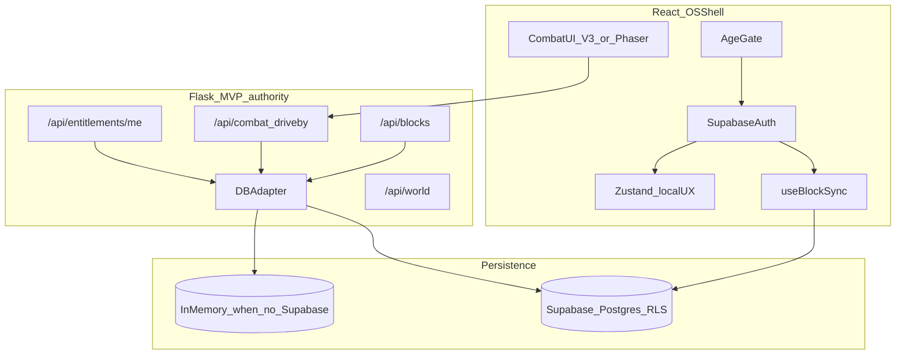

# SLIDE Phase 0A — Repository and Contract Reconciliation

**Prepared:** July 17, 2026  
**Mode:** Local Agent only — planning gate; **no feature code until this plan is approved**  
**Repo truth:** `/Users/bdmacbook/Documents/slide` → `https://github.com/BrandDead/slide.git`  
**Not truth alone:** `/Users/bdmacbook/Documents/slide-main-tL2525` (git-less snapshot; missing Las Olas / readiness commits)

---

## 1. Recommended integration base and merge strategy

### Decision

| Choice | Value |
|--------|--------|
| **Integration base** | `origin/agent/mvp-readiness-2026-07-16` |
| **Feature branch (after approval)** | `feat/mvp-vertical-slice` created from that tip |
| **Default branch policy** | Never commit directly to `main-tL2525`; land via PR |
| **Deferred branch** | `origin/agent/las-olas-graphics-destruction` — **do not merge separately** |

### Why mvp-readiness (not main, not las-olas alone)

Verified after `git fetch origin --prune` (2026-07-17):

| Fact | Evidence |
|------|----------|
| Both agent branches fork from current `origin/main-tL2525` tip | Merge-base = `7b7df1d` (Bip N Dip / #74) |
| Las Olas **does** exist in-repo | On both agent branches; **absent** from `main-tL2525` |
| Graphics trees are **byte-identical** between agent branches | SHA256 match for V3 renderer, `lasOlas1208Scene.ts`, Impact/Ragdoll engines, thin `CanvasStreetRenderer` shim |
| mvp-readiness is a **strict functional superset** of las-olas | Same 6 graphics commits (reapplied SHAs) **plus** `3557d2a` paid-MVP foundation |

**Preserve from mvp-readiness (do not recreate):**

- `frontend/src/components/slide/CanvasStreetRendererV3.tsx`
- `frontend/src/config/lasOlas1208Scene.ts`
- `frontend/src/components/dev/ShooterGraphicsLab.tsx`
- `frontend/src/utils/ImpactEngine.ts`, `RagdollEngine.ts`
- `docs/SHOOTER_GRAPHICS_QA.md`, `docs/GRAPHICS_UPGRADE_1208_LAS_OLAS.md`
- `docs/MVP_STATUS_AND_DEV_PLAN_2026-07-16.md`, `docs/MVP_2026_SCOPE.md`
- Age gate (`AgeGate.tsx` + tests), identity hydration (`authPlayer.ts` + tests)
- Entitlement foundation (`004_paid_entitlements.sql`, `api/entitlements.py`, read-only `/api/entitlements/me`)

**Intentionally defer from readiness branch into later gates:**

- Checkout / webhook / paid lock UI (Gate 4 / post-alpha-loop)
- Broad payment product config
- Any production secret usage

### Exact merge/cherry-pick strategy (after approval)

```text
1. cd /Users/bdmacbook/Documents/slide   # NOT slide-main-tL2525
2. git fetch origin --prune
3. git checkout -B feat/mvp-vertical-slice origin/agent/mvp-readiness-2026-07-16
4. # Optional safety check: confirm local main is not needed
   git log --oneline origin/main-tL2525..HEAD   # expect readiness commits
5. Fast-forward or merge origin/main-tL2525 ONLY if main advances with unique commits
   after this plan’s freeze point; resolve conflicts preserving V3 + age gate + entitlements.
6. Do not cherry-pick las-olas commits (content already present).
7. Tag baseline: git tag -a phase-0a-baseline -m "Pre Gate 0B baseline"
```

**Local machine note:** Current checkout `main-tL2525` was **25 commits behind** `origin/main-tL2525` before this audit. Always sync from remotes; do not treat an old local tip as base.

**Workspace note:** Cursor agent root should remain `/Users/bdmacbook/Documents/slide`. The `slide-main-tL2525` folder is an incomplete export and caused the false “Las Olas not in repo” conclusion.

---

## 2. Baseline health commands

Run from a **clean** tree on the integration tip (after checkout in §1). Document pass/fail in the gate report before Gate 0B.

### Frontend (`frontend/`)

| Check | Command | Notes |
|-------|---------|--------|
| Install | `npm ci` | Prefer lockfile-clean install |
| Unit tests | `npx vitest run` | `package.json` `"test"` is still a stub echo; vitest is a dep and tests exist on readiness |
| Typecheck | `npm run typecheck` | `tsc --noEmit` |
| Lint | `npm run lint` | Expect pre-existing warnings; treat *errors* as blockers |
| Production build | `npm run build` | Prefer build+preview for Mapbox (see AGENTS gotcha) |
| Visual smoke | `npm run preview -- --port 3000` then open ShooterGraphicsLab per docs | Query/flag path in `docs/SHOOTER_GRAPHICS_QA.md` |

### Backend (`backend/python/`)

| Check | Command | Notes |
|-------|---------|--------|
| Venv | `python3 -m venv venv && ./venv/bin/pip install -r requirements.txt` | If missing |
| Tests | `./venv/bin/python -m pytest` | **Blank** `SUPABASE_URL` / `DATABASE_URL` in `.env` for mock mode |
| Smoke API | `./venv/bin/python app.py` then `curl localhost:5000/api/health` (or documented health route) | Dev `DEV_USER` auth bypass |

### Local full-stack smoke

1. Backend mock mode (blank Supabase server env).
2. Frontend with local Supabase **or** documented staging anon keys (never commit).
3. Path: AgeGate → Auth → onboarding shell → open MAP or ShooterGraphicsLab.
4. Confirm no blank white screen from mapbox-gl default-export interop (`AGENTS.md` GOTCHA 1).

### Acceptance for Phase 0A baseline

- Frontend: vitest green on readiness suite; typecheck clean; production build succeeds.
- Backend: pytest green in blank-Supabase mock mode (readiness claimed 37; re-verify and record count).
- No secrets in Git (`git secrets` / manual review of staged files).

---

## 3. Runtime authority map (one page)

**Working rule:** Geometry decides collision / placement / combat facts. AI pixels decide atmosphere only. (Schemas introduced in Gate 0B; Overture ingest in Gate 3.)



| Domain | Authoritative path for MVP | Explicit non-authority (do not grow) |
|--------|----------------------------|--------------------------------------|
| **Identity** | Supabase Auth session → `authPlayer` hydration into player profile | Orphan local profiles that ignore account switch |
| **Claim** | Flask `POST /api/blocks/claim` via `DBAdapter` (+ Edge only if documented as temporary twin) | TerritoryMap-only `$2k` local claim; dual costs |
| **Placement** | Server-backed placements (API or documented Supabase table with RLS) keyed toward future **anchor IDs** | Pixel-only client positions without revision |
| **Economy** | Server-validated money/heat/inventory for the vertical slice; Zustand as cache | Market catalog that never hits API |
| **Combat result** | Flask combat/driveby session + persisted consequences; V3/Las Olas as **presentation** until Phaser parity | Client-only win that mutates Zustand without API |
| **Entitlement** | DB entitlements + read-only `/api/entitlements/me`; grants only via future server webhooks | Browser-trusted “I paid” flags |
| **Scene geometry (later)** | Immutable `BlockSceneManifest` version | AI plate pixels, Street View cache as gameplay |

---

## 4. Environment variable classification

Update `.env.example` files to match this table during Gate 0B setup (no real values in Git).

### Browser-safe (`frontend/.env` — `VITE_*` only)

| Variable | Required for | Notes |
|----------|--------------|--------|
| `VITE_SUPABASE_URL` | Auth UI | App throws if missing (`supabase.ts`) |
| `VITE_SUPABASE_ANON_KEY` | Auth UI | Anon only |
| `VITE_API_URL` | Flask calls | e.g. `http://localhost:5000` |
| `VITE_MAPBOX_ACCESS_TOKEN` | Map / geocode | **Canonical name**; code also reads `VITE_MAPBOX_TOKEN` in places — Gate 0B must unify |
| `VITE_ENV` | Feature flags | `development` / `staging` |
| `VITE_SOCKET_URL` | Optional | Unused until Realtime/Socket decision; keep optional |

### Server-only (`backend/python/.env` — never `VITE_`)

| Variable | Required for | Notes |
|----------|--------------|--------|
| `SUPABASE_URL` | Live DB | **Leave blank** for pytest/mock |
| `SUPABASE_SERVICE_ROLE_KEY` | Server writes | Staging/prod only; never frontend |
| `SUPABASE_ANON_KEY` | Optional server | Prefer service role server-side |
| `DATABASE_URL` | Alternate PG | Blank in mock mode |
| `MAPBOX_ACCESS_TOKEN` | Server geocode / static | Server token |
| `SECRET_KEY` | Flask sessions/JWT | Local random OK |
| `CORS_ORIGINS` | Dev CORS | localhost ports |
| `HOST` / `PORT` | Bind | Default `5000` |

### Staging-only (Cursor Cloud / CI secrets — not committed)

| Variable | Purpose |
|----------|---------|
| Staging Supabase URL + anon + service role | E2E against non-prod project |
| Staging Mapbox token | Geocode/static with usage caps |
| Image-provider staging key | Gate 3 worker only; rate-limited |
| Payment processor **test** keys | Gate 4 only |

### Optional / feature flags

| Variable | Default | Notes |
|----------|---------|--------|
| `GOOGLE_MAPS_API_KEY` | empty | Do not enable Street View caching for combat art |
| `ENABLE_STREET_VIEW` | `false` | Keep false for MVP combat plates |
| `ENABLE_3D_TILES` | `false` | Deferred |
| `ENABLE_WORLD_TICK` | `true` | NPC scheduler later |

**Policy:** No production payment keys, no production image keys, no service-role in frontend, no unrestricted Street View prefetch into object storage for gameplay.

---

## 5. Risks, rollback, acceptance criteria

### Risks

| Risk | Mitigation |
|------|------------|
| Working in git-less `slide-main-tL2525` and “losing” Las Olas again | Agent root = `/Users/bdmacbook/Documents/slide`; document in AGENTS |
| Divergent local main (behind remote) | Always branch from fetched remote tips |
| Recreating V3 / age gate / entitlements | Diff against mvp-readiness before any rewrite |
| Dual claim/economy paths grow during Gate 0B | Runtime map above is binding; delete or wrap orphans |
| Mapbox blank screen in `npm run dev` | Prefer build+preview until `optimizeDeps.include` fix lands |
| `npm test` stub hides real failures | Use `npx vitest run`; fix script in Gate 0B |
| Cloud Agent before env.json/secrets | **Local-first**; cloud only after `.cursor/environment.json` + staging secrets |

### Rollback

1. Tag `phase-0a-baseline` on approved integration tip before Gate 0B commits.
2. Any bad Gate 0B commit: `git revert` or reset feature branch to tag (unpushed only); if pushed, revert PR.
3. Never force-push `main-tL2525`.
4. Keep `CanvasStreetRendererV3` until Phaser fixed-scenario parity (Gate 1 protocol).

### Phase 0A acceptance (stop here — wait for human approval)

- [ ] Written decision: base = `agent/mvp-readiness-2026-07-16`; las-olas deferred as duplicate content.
- [ ] Baseline commands listed and (after approval) executed with recorded results.
- [ ] Runtime authority table agreed (Flask + DBAdapter for MVP slice).
- [ ] Env classification documented; examples contain placeholders only.
- [ ] Feature branch name reserved: `feat/mvp-vertical-slice`.
- [ ] Product defaults locked for later gates (below).
- [ ] **No feature implementation commits yet.**

### Product defaults (human-confirmed via review doc)

| Decision | Default |
|----------|---------|
| First playable location | Pre-approved commercial/sample South Florida; Las Olas fixture as visual inspiration |
| Address policy | Commercial/sample first; residential → fictionalized district alias + stylized geometry; never publish private street as attack target |
| Combat feel | Arcade drive-by 45–75s; obvious civilians; cover; reload/escape |
| Cameras | Side-scroll drive-by + tactical top-down |
| Art bar | Stylized 2.5D neon South Florida; not photoreal |
| Audience | Closed adult-only alpha; solo + NPC |
| Monetization | Access + cosmetics/founder recognition only after alpha loop; Cursor owns payment engineering |

---

## 6. What happens after approval (not started yet)

| Gate | Objective |
|------|-----------|
| **0B** | One claim→deploy→earn→refresh path; typed `BlockSceneManifest` / `LiveBlockState` / `AttackSnapshot` contracts + tests |
| **1** | Phaser pilot + fixed NPC fixture; keep V3 until parity; first Manus combat kit via signed asset contract |
| **2** | NPC ownership / retaliation world loop |
| **3** | 80 m geometry pilot + constrained AI plates; privacy-safe location |
| **4** | AttackSnapshot fairness, telemetry, fallbacks, staging entitlements |

Cloud Agents: only after install/test commands + staging secrets + committed `.cursor/environment.json`.

---

## Stop

**Awaiting approval of this Phase 0A plan.** No Gate 0B code, no merges, no secret commits until you say proceed.
