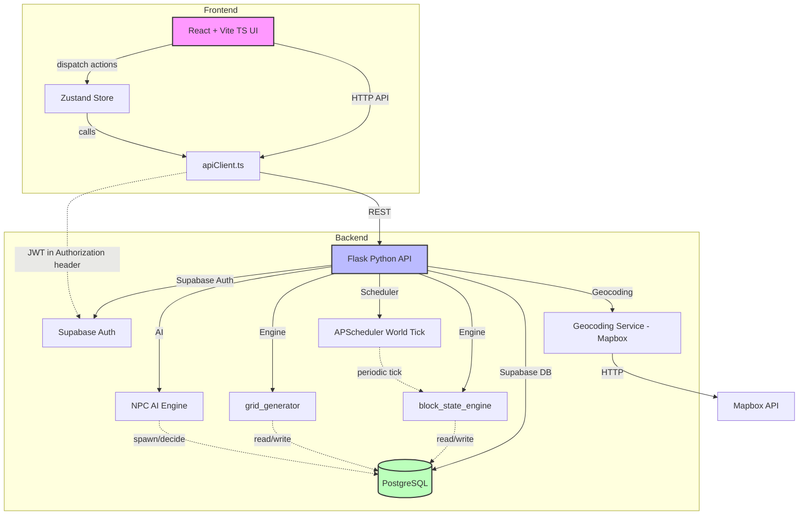
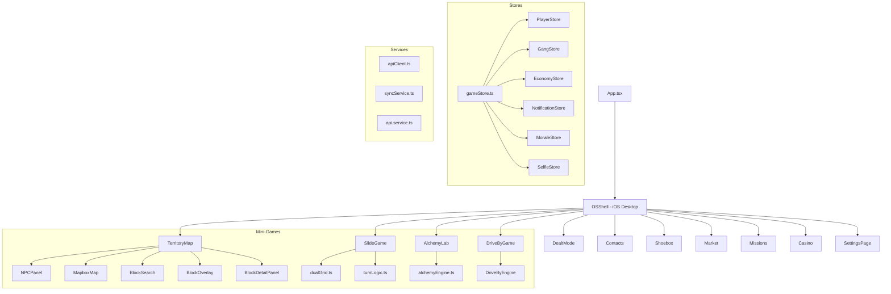
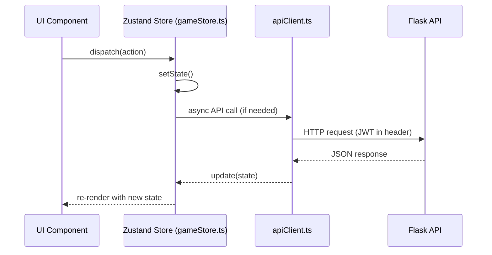
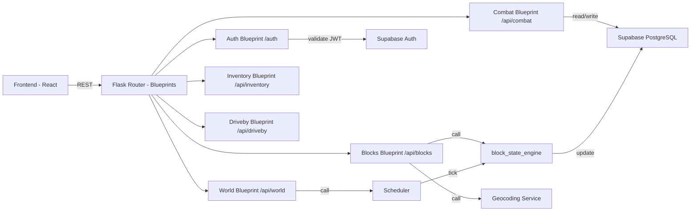
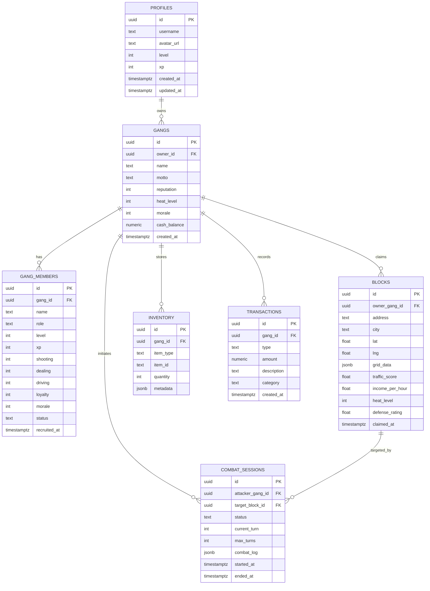

# DEALT/SLIDE Architecture Overview

This document provides an architectural snapshot of the DEALT/SLIDE game, showing how the
frontend, backend, state-management, and data layers interact. All diagrams are expressed
in **Mermaid** for easy visualisation.

---

## 1. System Architecture

- **Frontend** — Built with React, Vite, TypeScript and **Zustand** for client-side state.
- **Backend** — Flask serves a REST API. Business logic lives in the `api/` blueprints and in service modules (`block_state_engine`, `geocoding_service`, `grid_generator`, `npc_ai`, `scheduler`).
- **Supabase** — Provides PostgreSQL storage and authentication (JWT).
- **External** — Mapbox for geocoding and map visualization.

---

## 2. Frontend Component Tree

The tree shows the high-level UI modules and the major component files under each app.

---

## 3. Frontend State Management Flow (Zustand)

All game-wide data (player, gang, economy, notifications, morale, selfie) lives in a single
Zustand store file (`gameStore.ts`), providing a predictable, hook-based API for React components.

---

## 4. Backend API Flow

Requests travel through Flask blueprints, which delegate business logic to service modules.
All persistence is handled by Supabase.

---

## 5. Database Schema (Supabase/PostgreSQL)

The schema captures the core entities: profiles, gangs, members, blocks (territories), inventory, financial transactions, and combat sessions.

---

**End of ARCHITECTURE.md**
