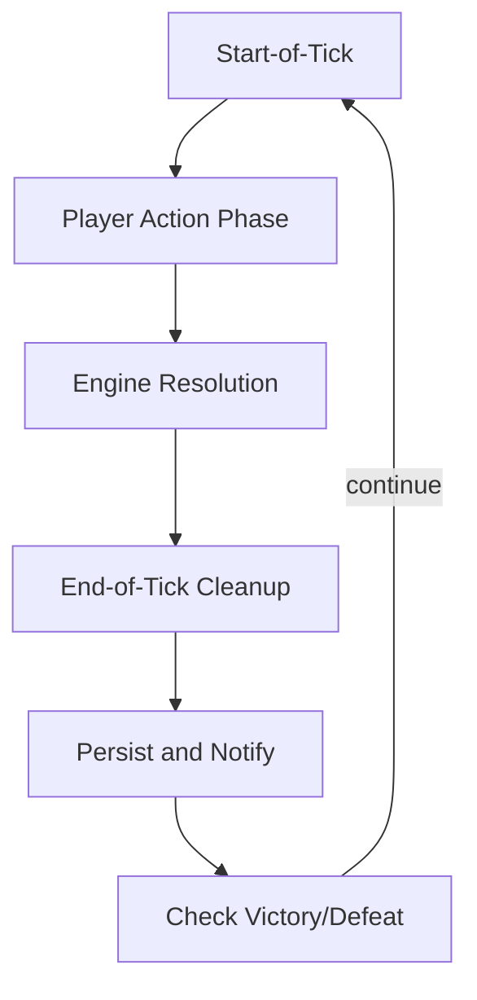
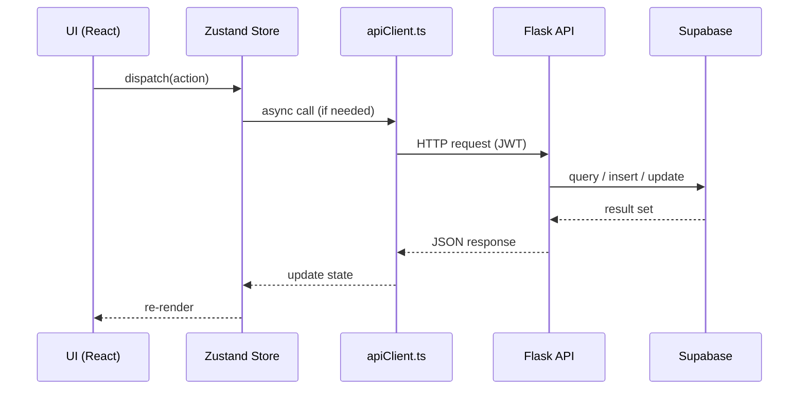
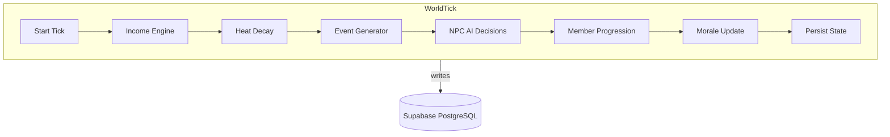
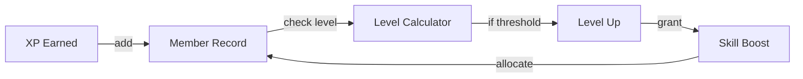

# DEALT/SLIDE Game Design Document

**DEALT/SLIDE** is an iOS-style desktop strategy game that puts the player in command of a street-gang empire. The game blends turn-based macro-management with real-time mini-games (drive-by, alchemy, casino, etc.). This document details the core loop, each app-module, and the underlying systems that drive gameplay.

---

## Table of Contents

1. [Game Loop Overview](#1-game-loop-overview)
2. [Mini-Game Mechanics (Apps)](#2-mini-game-mechanics-apps)
3. [Economy System](#3-economy-system)
4. [Heat System](#4-heat-system)
5. [Morale System](#5-morale-system)
6. [Member Progression](#6-member-progression)
7. [NPC AI Behaviour](#7-npc-ai-behaviour)
8. [Data Flow Diagrams](#8-data-flow-diagrams)

---

## 1. Game Loop Overview

The game runs on a **tick-based cycle** driven by the APScheduler world tick (default: every 30 seconds in real-time, representing a "day" in game time). Each tick consists of the following phases:

1. **Start-of-Tick Updates**
   - Resolve passive income (dealer earnings, bank interest via incomeEngine.ts).
   - Apply **heat decay** (heatSystem.ts) and **morale drift** (moraleSystem.ts).
   - Trigger scheduled **world events** via EventGenerator (raids, random events).

2. **Player Action Phase**
   - The player opens any combination of the 12 apps on the iOS-style desktop.
   - Within each app, they can perform actions (sell drugs, craft, attack, etc.).
   - Every action has consequences: money, heat, morale, and XP changes.

3. **Engine Resolution Phase**
   - **Alchemy Engine** processes pending recipes.
   - **Combat Resolver** resolves any queued fights (drive-by, street brawls).
   - **Heat System** reacts to crimes committed (heat spikes).
   - **Member Progression** awards XP for completed tasks.

4. **End-of-Tick Cleanup**
   - Persist state to the backend (Supabase) via syncService.ts.
   - Issue **notifications** (new missions, heat alerts, raid warnings).
   - Check for game-over conditions (heat reaches 100 = full crackdown).

| Concept | Description |
|---------|-------------|
| **Heat** | Law-enforcement pressure (0-100); high heat = raids, arrests, game over |
| **Morale** | Gang cohesion (0-100); low morale = members quit, betray, miss shots |
| **Income** | Derived from drug sales, dealer positions, bank interest |
| **Member XP** | Gained from combat, dealing, alchemy, missions |

---

## 2. Mini-Game Mechanics (Apps)

### 2.1 MAP (TerritoryMap)
- **Purpose**: Visualise the city, claim blocks, position gang members.
- **Block View**: 8x8 grid with terrain types (sidewalk, street, alley, building, lot, park, corner). Street-adjacent tiles earn more money but are more dangerous.
- **Hood View**: Mapbox map showing all claimed/NPC/unclaimed blocks as colored polygons.
- **Roster View**: List of all gang members with stats and deployment status.
- **Key Mechanic**: Member placement on the grid determines income AND vulnerability to drive-bys.

### 2.2 DEALT (DealtMode)
- **Purpose**: Tinder-style drug dealing interface. Swipe right to sell, left to pass.
- **Core Mechanic**: Each card shows a buyer with preferences, budget, and risk level. Matching the right drug to the right buyer maximizes profit.
- **Risk**: Selling to undercover cops (random chance based on heat) causes arrests.

### 2.3 SLIDE (SlideGame)
- **Purpose**: Battleship-style grid combat. Attack rival blocks or defend your own.
- **Phases**: Role Select → Placement → Battle → Game Over.
- **Attacker**: Shoots at the defender's 8x8 grid trying to hit placed members.
- **Defender**: Shoots at the attacker's car grid trying to stop the slide.
- **Key Mechanic**: Member shooting skill affects hit chance. High-level shooters rarely miss.

### 2.4 DRIVE (DriveByGame)
- **Purpose**: Real-time action mini-game. Drive past a block and shoot.
- **Core Mechanic**: Timed shooting sequence as the car moves past the block. Hit targets on the grid.
- **Outcome**: Kills reduce rival gang strength, but heat spikes dramatically (+12 per drive-by).

### 2.5 COOK (AlchemyLab)
- **Purpose**: Little Alchemy-style drug crafting.
- **Core Mechanic**: Combine base ingredients to create drugs. Combine drugs to create super drugs.
- **5 Tiers**: Base → Basic → Advanced → Premium → Legendary.
- **Risk**: Super drugs make tons of money but can OD customers, raising heat and causing raids.
- **Recipe Book**: Tracks discovered recipes and their stats (purity, potency, OD risk, price).

### 2.6 CREW (Contacts)
- **Purpose**: Recruit, manage, and upgrade gang members.
- **Roles**: Shooter, Dealer, Enforcer, Dog (guard).
- **Progression**: Members gain XP from activities. Level up shooting/dealing skills.
- **Morale**: Individual member morale affects performance. Low morale = missed shots, no-shows.
- **Bail/Hospital**: Pay to bail out arrested members or heal wounded ones. Ignoring them drops morale.

### 2.7 SHOEBOX (Banking)
- **Purpose**: Banking system. Deposit cash for safety and interest.
- **Features**: Deposit, withdraw, transaction history, interest accrual.
- **Key Mechanic**: Cash in the shoebox is safe from raids. Cash on the street can be seized.

### 2.8 MARKET (Underworld Shop)
- **Purpose**: Buy weapons, equipment, vehicles, and supplies.
- **Categories**: Weapons, Protection, Vehicles, Supplies, Special.
- **Key Mechanic**: Better weapons = better combat stats. Vehicles unlock new mission types.

### 2.9 OPS (Missions)
- **Purpose**: Mission board with procedurally generated operations.
- **Types**: Deal, Slide, Collect, Recruit, Defend.
- **Rewards**: Cash, XP, reputation, rare items.
- **Risk**: Higher difficulty missions have higher heat consequences.

### 2.10 CASINO
- **Purpose**: Gambling mini-games to boost or lose cash.
- **Games**: Dice (over/under), Hi-Lo (card guessing), Slots (3-reel).
- **Key Mechanic**: Cash sink to regulate inflation. Win streaks boost morale.

### 2.11 PHONE (Placeholder)
- **Purpose**: Contact management, call allies, receive messages.
- **Future**: Relationship system with contacts, favors, intel.

### 2.12 SETTINGS
- **Purpose**: Game preferences, sound, notifications, save/load.

---

## 3. Economy System

### 3.1 Income Sources

| Source | Description | Frequency |
|--------|-------------|-----------|
| **Dealer Income** | Members placed on block earn based on position (street proximity) | Per tick |
| **Drug Sales (DEALT)** | Revenue from selling drugs to buyers | Per sale |
| **Bank Interest** | 2% per tick on deposited cash | Passive |
| **Missions (OPS)** | Cash reward on completion | On completion |
| **Casino Winnings** | Gambling profits | Per game |

### 3.2 Spending

| Category | Examples |
|----------|---------|
| **Market Purchases** | Weapons, vehicles, equipment |
| **Member Costs** | Recruitment ($500-$2000), bail ($1000-$5000), hospital ($500-$3000) |
| **Alchemy Ingredients** | Base materials for drug crafting |
| **Member Training** | Level up shooting/dealing skills |

### 3.3 Banking

| Feature | Mechanic |
|---------|----------|
| **Shoebox** | Cash stored here earns 2% interest per tick and is safe from raids |
| **Street Cash** | Cash on hand can be seized during police raids |
| **Laundering** | Future: convert dirty money to clean money at a fee |

---

## 4. Heat System

Heat measures law-enforcement attention. It is a **single integer** ranging 0-100.

### 4.1 Heat Generation

| Action | Heat Change |
|--------|------------|
| Drug sale (per $1k) | +0.2 |
| Claim/Abandon block | +5 |
| Drive-by (successful) | +12 |
| High-value slide | +8 |
| Member on block too long | +1 per tick |
| Bribe (using bribe token) | -15 |

### 4.2 Heat Decay

- **Base decay**: -3 per tick (minimum 0)
- **Low heat bonus**: If heat < 30, decay becomes -5 per tick
- **High heat penalty**: If heat > 70, decay slows to -1 per tick

### 4.3 Heat Consequences

| Threshold | Consequence |
|-----------|-------------|
| 30+ | Morale drops -2 per 10 heat above 30 |
| 50+ | Random police patrols on your blocks |
| 70+ | 30% chance of raid per tick (seize product, arrest members) |
| 100 | **Game Over** — full crackdown, lose all territory |

---

## 5. Morale System

Morale is a **percentage** (0-100) representing gang cohesion.

### 5.1 Morale Sources

| Source | Morale Change |
|--------|--------------|
| Successful mission | +5 to +10 |
| Member promotion | +3 |
| Casino win | +4 |
| Consistent income (3+ ticks) | +6 |
| Heat penalty (per 10 above 30) | -2 |
| Member death | -8 |
| Low cash (< $1k) | -5 |
| Casino loss | -4 |
| Unbailed member | -3 per tick |

### 5.2 Morale Effects

| Morale Range | Effect |
|-------------|--------|
| 70-100 | +0.5 XP bonus per tick, +1% income |
| 40-69 | Normal operation |
| 20-39 | 10% chance member quits per tick, -10% combat accuracy |
| 0-19 | Members may shoot each other, refuse orders, steal from stash |

---

## 6. Member Progression

### 6.1 Experience and Leveling

- **XP Gain**: Each action awards base XP (10 per combat, 5 per sale, 8 per alchemy)
- **Level Curve**: `XP_needed = 100 * (level ^ 1.5)`
- **Level Effects**: Higher levels improve role-specific skills

### 6.2 Skills

| Skill | Effect | Improved By |
|-------|--------|-------------|
| **Shooting** | Hit chance, damage | Combat, drive-bys |
| **Dealing** | Sale price bonus, bigger deals | Drug sales, DEALT |
| **Driving** | Escape chance, slide speed | Drive-bys, slides |
| **Loyalty** | Resistance to quitting, betrayal | Time served, morale |

### 6.3 Member Status

| Status | Description |
|--------|-------------|
| **Active** | Available for deployment |
| **Deployed** | Placed on a block, earning income |
| **Injured** | Needs hospital payment to recover |
| **Arrested** | Needs bail payment to release |
| **Dead** | Permanently removed |
| **AWOL** | Left due to low morale |

### 6.4 Heat Risk for High-Level Members

High-level members are more effective but generate more heat. A shooter with 80+ shooting skill will rarely miss, but their reputation attracts police attention faster. Members caught too many times go to jail for life.

---

## 7. NPC AI Behaviour

### 7.1 Rival Gangs (npc_ai.py)

The NPC AI system uses a **behavior engine** with weighted decisions:

| Behavior | Trigger | Effect |
|----------|---------|--------|
| **Patrol** | Default | NPC members patrol their blocks |
| **Expand** | Resources > threshold | Attempt to claim neutral blocks |
| **Raid** | Aggression high + player weak | Attack player's blocks |
| **Retaliate** | Player attacked NPC | Counter-attack with boosted aggression |
| **Defend** | Under attack | Pull members back to defend |

### 7.2 Gang Spawning

- Gangs spawn based on city and difficulty (1-5)
- Higher difficulty = more members, better stats, more aggression
- Each gang has personality traits: aggression, greed, loyalty, recklessness

### 7.3 Police and Heat Enforcement

- **Patrol Scheduler**: Random patrols on high-heat blocks
- **Raid Logic**: Heat > 70 = 30% raid chance per tick
- **Raid Outcome**: Seize inventory, arrest members, confiscate cash on street

---

## 8. Data Flow Diagrams

### 8.1 Frontend to Backend Interaction

### 8.2 World Tick Engine Flow

### 8.3 Member Progression Pipeline

---

## 9. Glossary

| Term | Meaning |
|------|---------|
| Heat | Law-enforcement pressure; rises with crime, decays over time |
| Morale | Gang cohesion; influences combat, income, and retention |
| XP | Experience points for member progression |
| Block | A real-world address claimed as territory, represented as 8x8 grid |
| Slide | A drive-by attack on a rival block |
| Cook | Crafting drugs in the Alchemy Lab |
| Dealt | Drug dealing mini-game |
| Shoebox | Banking system (cash stored under the bed) |
| OPS | Operations/Missions board |

---

**End of GAME_DESIGN.md**
