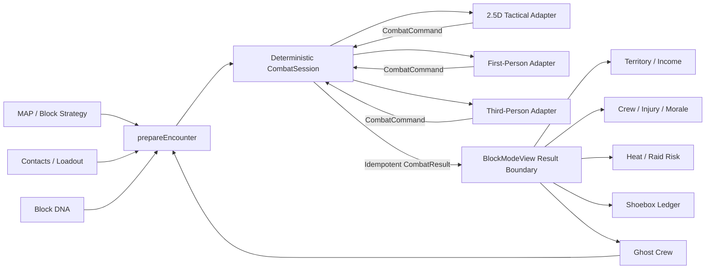

# DEALT / SLIDE — Modern Gameplay Completion Plan

**Author:** Manus AI  
**Prepared:** 2026-08-26  
**Baseline:** `main-tL2525` at `c178861`  
**Implementation branch:** `feat/modern-gameplay-completion`

## Product Direction

**DEALT / SLIDE remains an iOS-like strategy game first.** The player scouts and claims a real-world-inspired block, deploys a crew, assigns product and equipment, manages cash, heat, morale, injuries, and retaliation, then enters a modern action encounter when a strategic decision turns violent. The first-person and third-person modes are not separate games; they are camera-and-input adapters over the same deterministic encounter session that the tactical view already uses.

> The authoritative state must stay independent of presentation. MAP and the block view create an encounter preparation; the combat session owns legal commands and outcomes; tactical, first-person, and third-person renderers consume the same snapshot and emit the same typed commands; one idempotent result returns to the block, crew, heat, morale, and Shoebox systems.

## What Comes After Stripe

Stripe is not the next gameplay bottleneck. The repository already has a broad set of mini-games and economy surfaces, but the remaining work is primarily **integration, opposition, presentation, and release discipline**.

| Priority | Workstream | Why it is next | Existing work to reuse |
|---|---|---|---|
| P0 | Recover and reconcile `copilot/dev-oplan` | Six unmerged commits already implement major parts of issues #78–#81 and the beta gate. Rebuilding them would duplicate tested work. | Ghost Crew engine/store, 17-card Block DNA library, manifest/runtime cleanup, smoke tests, release checklist |
| P0 | Lock the strategy-to-action contract | Every combat presentation must change the same empire state exactly once. This prevents disconnected mini-games and duplicate rewards. | `prepareEncounter`, `combatSession`, `CombatCommand`, `CombatResult`, `BlockModeView.applyEncounterResult` |
| P1 | Ship one modern 3D action vertical slice | The current Phaser encounter is deterministic and integrated but not a modern FPS/TPS experience. One hero block should support tactical, first-person, and third-person play before adding more modes. | Unified encounter preparation and result flow, Block DNA, Las Olas art direction, drive-by HUD patterns |
| P1 | Make the rival crew visibly persistent | Strategy needs an opponent that claims turf, earns, remembers attacks, and triggers the normal encounter path. | Recovered Ghost Crew branch plus existing notification/map stores |
| P2 | Complete the authored Block DNA path | Blocks must look and play differently without relying on Mapbox at combat time. | Main has 8 cards; the recovered branch grows this to 17 |
| P2 | Finish the canonical visual stack | The strategy view remains a 2.5D tactical diorama; the action view projects the same DNA into a 3D encounter. | V3 renderer, projection layer, asset resolver, runtime audit |
| P3 | Close the release umbrella | Outside testing should start only after browser smoke, performance, persistence, error-state, and release-checklist evidence is attached. | 652 frontend tests, 42 backend tests, asset audit, recovered beta smoke tests |

## Target Gameplay Architecture

The engine boundary is deliberate. React owns the OS shell, briefing, HUD, mode selection, and result application. The 3D engine owns the canvas, camera, input, scene projection, animation, and effects. The deterministic TypeScript combat session remains framework-agnostic and must never import React, Phaser, Babylon, the stores, or persistence services.

## Camera and Control Contract

| Mode | Purpose | Input | Shared-state behavior |
|---|---|---|---|
| Tactical | Position the selected member, inspect cover, command the squad | Click/tap selection and adjacent-grid commands | Emits existing move, fire, reload, interact, and retreat commands |
| First person | High-intensity direct control of the selected shooter | WASD, mouse look, aim, fire, reload, interact, camera toggle | Quantizes player movement and target selection into legal combat commands; presentation never applies damage directly |
| Third person | Situational movement and cover readability | WASD, orbit/shoulder camera, aim, fire, reload, interact, camera toggle | Uses the same command adapter and current selected combatant |

The first implementation should support one controllable crew member, one hero DNA block, a small opposition squad, cover, aim/fire/reload, extraction, camera switching, HUD feedback, pause/exit, and deterministic demo mode. Squad command shortcuts and deeper AI can follow after this vertical slice is stable.

## Delivery Plan

### Milestone 0 — Recover Existing Work

Rebase or cherry-pick the six unique `copilot/dev-oplan` commits onto the current default branch. Resolve conflicts against the already-merged playable map and bullet-camera work. Keep the pieces that pass current tests, remove superseded duplication, and preserve the newer map/encounter integration.

Acceptance requires the 17-card DNA library, Ghost Crew state and tests, runtime-manifest cleanup, beta smoke tests, and release checklist to pass on the current main baseline. Issues #78–#81 must then be re-evaluated against code rather than their stale checkbox lists.

### Milestone 1 — Shared Action Adapter

Introduce a presentation-neutral action adapter that tracks the selected combatant, translates continuous movement into legal adjacent-grid commands, resolves aim targets from the current snapshot, advances simulation ticks, and exposes stable HUD data. Both the Phaser tactical scene and the new 3D scene should use this adapter over time; the first slice may leave Phaser on its existing direct path while tests establish parity.

Acceptance requires deterministic command sequencing, no duplicate result commitment, safe pause/exit, and unit tests for movement, firing, reload, camera-independent snapshots, and result idempotency.

### Milestone 2 — Modern 3D Encounter Vertical Slice

Add a full-screen 3D encounter surface under `BlockModeView` as an additional action presentation, initially for one Las Olas-derived DNA card. Generate an art-direction target and a small runtime art set, project DNA zone rows into simple procedural street geometry, add readable crew/opposition proxies, cover, lighting, particles, weapon feedback, a first-person camera, a third-person shoulder camera, and a deterministic `?demo` path.

Acceptance requires a visible authored place rather than a gray blockout, responsive movement and aim, camera switching, firing/reload feedback, opposition return fire, extraction, a single committed `CombatResult`, cleanup on unmount, and no loss of the existing tactical encounter.

### Milestone 3 — Rival and Territory Integration

Wire Ghost Crew ownership into the playable map and attack flow. A player attack on ghost turf records a grudge, and a ghost action against player turf creates a visible threat that enters the same encounter preparation and result boundary. Move long-term rival persistence from browser-only storage to the existing backend/Supabase contract after the local deterministic loop is stable.

Acceptance requires a three-tick idle scenario to change the map and City Feed, a player counterattack to reclaim turf through normal combat, and persistence across reloads without duplicating blocks or feed events.

### Milestone 4 — Visual, Asset, and Performance Gate

Keep the strategy layer’s 2.5D diorama as the canonical overview while extending the art bible with a matching action-camera contract. Register the seven current orphan assets, remove stale `.png` references, finish real alpha and defringe work, keep runtime assets under the 20 MB gate, split circular chunks, and establish browser performance budgets for the 3D scene.

Acceptance requires zero asset-audit errors, no missing runtime images, no placeholder emoji or legacy sprite path in player-facing block/combat views, stable cleanup after repeated mode entry, and screenshot evidence from tactical, first-person, and third-person views.

### Milestone 5 — Beta Gate and Repository Closure

Run frontend typecheck, Vitest, asset audit, production build, backend Pytest, browser smoke, and deterministic visual capture. Update the release checklist and project log. Close or rewrite stale issues based on verified acceptance, prune merged/stale branches while preserving any documented rollback anchor, and merge only through a reviewed pull request.

## Issue Reconciliation

| Issue | Current verified state | Completion action |
|---|---|---|
| #78 | Core manifest resolver is already live; legacy fallback remains only for missing art/compatibility. | Land recovered manifest changes, verify player-facing consumers, generate any missing role states, then close or narrow the issue. |
| #79 | Runtime audit passes at 5.73 MB with zero errors and seven orphan warnings. | Register/remove the seven orphans, verify alpha/fringe acceptance, and keep the CI gate. |
| #77 | Projection and V3 renderer exist, but the art/camera contract is not complete and action cameras are absent. | Publish one combined 2.5D strategy plus 3D action camera contract and prove it on the hero block. |
| #80 | Main has 8 authored cards; recovered branch has 17; target remains 30–40. | Land 17 now, tune and visually validate 5–10, then expand deliberately to 30–40. |
| #81 | Main only has lightweight retaliation; recovered branch has a substantial local Ghost Crew implementation. | Reconcile it, connect attacks/results, then add backend persistence. |
| #45 | Tests are healthy, but production build is memory-heavy and browser/action evidence is incomplete. | Treat as the final umbrella after the above issues and the 3D vertical slice are verified. |

## Current Quality Baseline

| Gate | Result on `c178861` |
|---|---|
| Frontend typecheck | Passed |
| Frontend tests | 40 files, 652 tests passed |
| Frontend lint | Passed with warnings only |
| Runtime asset audit | Passed; 5.73 MB of 20 MB, seven orphan warnings |
| Backend tests | 42 passed in offline mock mode |
| Production build | Transformed 2,437 modules, then was terminated by sandbox memory pressure during chunk rendering; existing circular chunk warnings remain |
| Default-branch CI | Latest run passed |

## Non-Goals for the First Slice

The first slice will not attempt a broad open-world shooter, multiplayer netcode, fully simulated vehicles, realistic weapon replication, or dozens of 3D maps. It will not replace the strategy game with a shooter. The objective is a coherent loop in which one strategic decision becomes one polished action encounter and returns durable consequences to the empire.

## References

[1]: https://github.com/BrandDead/slide/issues/45
[2]: https://github.com/BrandDead/slide/issues/77
[3]: https://github.com/BrandDead/slide/issues/78
[4]: https://github.com/BrandDead/slide/issues/79
[5]: https://github.com/BrandDead/slide/issues/80
[6]: https://github.com/BrandDead/slide/issues/81
[7]: https://github.com/BrandDead/slide/pull/118
[8]: https://github.com/BrandDead/slide/blob/main-tL2525/docs/PROJECT_LOG.md
