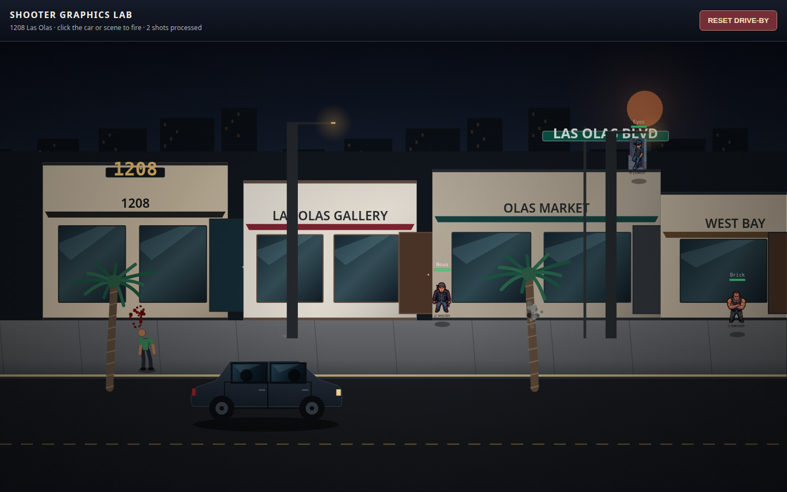
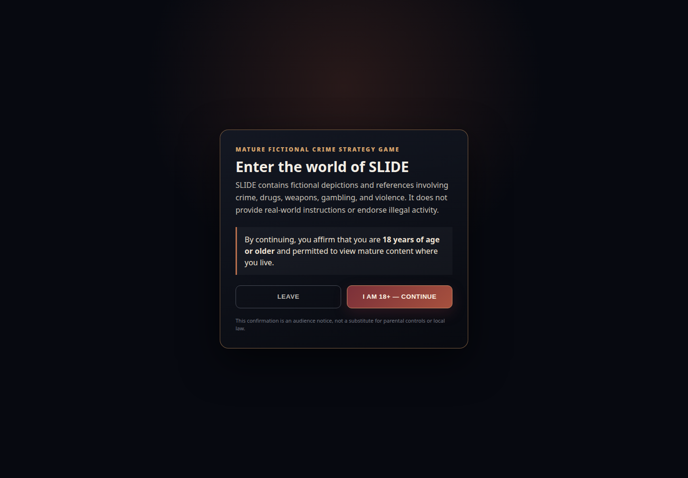

# SLIDE MVP Status and Development Plan

**Prepared by:** Manus AI  
**Date:** 2026-07-16  
**Repository:** `BrandDead/slide`  
**Working branch:** `agent/mvp-readiness-2026-07-16`

## Executive conclusion

**SLIDE is not yet ready to accept paying players.** It is best described as a **pre-MVP or closed-alpha foundation**: the repository contains a substantial iOS-style game shell, many playable-looking modes, a real combat engine, strong local simulation systems, and now a coherent shooter presentation, but it does not yet provide the complete production journey that a paying player must be able to trust. A clean player still needs verified production authentication, one server-authoritative empire loop, reliable cross-session persistence, complete payment fulfillment, and basic live operations.[1] [3]

The shortest path to revenue is **not another mini-game or another neighborhood**. The immediate objective should be a tightly controlled web beta built around one connected loop:

> **Choose a block → recruit a dealer and shooter → position them → equip product → make deals → generate heat → survive one attack or raid → resolve wounds/arrests → reinvest → return to the same saved empire.**[3]

The shooter-graphics requirement is no longer the primary blocker. The integrated Las Olas V3 renderer establishes an appropriate grounded tropical-noir direction for a controlled paid alpha. It renders a layered South Florida street scene, crew, a drive-by vehicle, impacts, destructible surfaces, vehicle damage, and ragdolls through the real combat engine.[2] The next visual work should improve **readability and device performance**, not replace the renderer.

## What was verified before implementation

The audited default branch is a React 18, TypeScript, and Vite frontend with a Flask API and Supabase/PostgreSQL persistence design. It includes the iOS-style desktop and substantial MAP, CREW, DEALT, SLIDE, DRIVE, TOPDOWN, COOK, economy, and auxiliary mini-game surfaces.[1]

The main readiness problem was architectural rather than conceptual. Rich Zustand/local-storage systems, partial Supabase synchronization, legacy or mock backend routes, and multiple game engines coexist, but they did not yet form one verified production journey. Documentation claiming an MVP therefore overstated the end-to-end condition of the deployed product.[1]

| Area audited | Verified state before this work | Consequence |
|---|---|---|
| Authentication | Sign-in UI and Supabase service existed, but production credentials and the complete return-session flow were not verified | A fresh checkout could build but could not become a real playable production account without deployment configuration |
| Identity hydration | Authenticated Supabase identity was not reliably reconciled into the local player profile | Persistence hooks could remain inactive or one browser could carry stale profile data across account changes |
| Shared persistence | Block synchronization code existed but was not mounted at the application root; broader state remained fragmented | A player could not yet trust that one empire would survive refresh, sign-out, or another device |
| Combat visuals | Multiple combat modes existed, but quality varied between canvas work, procedural silhouettes, emoji, and grids | Marketing and playtest presentation lacked one consistent bar |
| Payments | No executable checkout, webhook, entitlement, refund, or grant/revoke flow existed | Taking money would have been unsafe because access fulfillment was not server-authoritative |
| Compliance and operations | No verified mature-content entry notice, payment ledger, support operations, or launch runbook existed | The game lacked minimum controlled-beta safeguards |

## Implementation completed in this branch

### Shooter presentation and QA

The six validated commits from the Las Olas graphics branch were integrated rather than re-created. This added the 1208 Las Olas scene manifest, articulated ragdoll physics, persistent material-specific damage, breakable glass and storefront elements, vehicle hit regions, pooled effects, a V3 combat renderer, and the coordinate repair that routes grid shots through the correct renderer.[2]

A deterministic `ShooterGraphicsLab` was added behind both a build-time flag and an explicit query parameter. It exercises the real combat renderer with type-safe crew placements, a drive-by event, targets, impacts, and player input without creating a production authentication bypass.[9] A clean production capture confirms the integrated scene renders successfully.[2]

### Account identity and progression plumbing

The root application now reconciles the authenticated Supabase user with the local player profile and mounts the existing block synchronization hook. The account-switch path produces a fresh player profile instead of silently inheriting the prior account’s profile, while a returning matching account preserves progression.[8] [10]

Five regression tests cover first-session hydration, matching-account preservation, profile-field preservation, account switching, and non-mutation of the prior profile.[11]

### Mature-content entry gate

A versioned, fail-closed age and fictional-content notice now appears before authentication and onboarding. It requires the player to affirm that they are at least 18, describes SLIDE as fictional, and explicitly states that the game does not provide real-world instructions or endorse illegal activity.[4] [5]

Three tests cover the versioned storage contract, a previously accepted version, and browser-storage failure behavior.[12] A clean production-build capture verifies the screen is legible and correctly ordered when required runtime configuration is present.[4]

### Paid-access foundation

A new migration defines an inactive `founders-access` product, idempotent processor event records, revocable and expiring owner-scoped entitlements, useful indexes, and row-level-security policies. Browsers can read only their own entitlements; no browser insert, update, or delete policy exists for grants, revocations, or payment events.[6]

A read-only authenticated endpoint at `GET /api/entitlements/me` returns effective entitlements for the verified session owner. It exposes no grant or mutation route, defaults paid-beta access closed, and returns a retryable service error if the entitlement store is unavailable.[7]

This is **payment plumbing, not a finished payment system**. Checkout-session creation, processor webhook signature verification, event processing, product/price configuration, refund handling, an access lock, and an administrative grant/revoke tool remain to be built.

### Product scope and evidence

The branch now contains a written paid-MVP scope, an audit record, shooter QA evidence, age-gate QA evidence, and this implementation report. The scope deliberately excludes extra cities, large-scale multiplayer, native mobile release, a broad drug catalog, premium power-item sales, and additional mini-games from the critical path.[3]

## Validation performed

| Validation | Result | Notes |
|---|---|---|
| Frontend unit tests | **22 passed across 3 test files** | Includes 5 identity-hydration tests, 3 age-gate tests, and 14 economy tests |
| Frontend TypeScript validation | **Passed** | `tsc --noEmit` completed without errors |
| Frontend production build | **Passed** | 2,274 modules transformed; build completed successfully |
| Backend API tests | **37 passed** | Includes 2 paid-entitlement endpoint tests |
| Shooter visual QA | **Passed for desktop closed-alpha bar** | Clean production build captured at 1440×900 through the real V3 renderer |
| Age-gate visual QA | **Passed** | Clean production build captured at 1440×1000 |
| Repository hygiene | **Passed** | `git diff --check` completed without whitespace errors |

The build still reports circular manual chunks and a Mapbox vendor bundle of approximately 1.66 MB minified, approximately 447 KB gzip. The backend suite reports 95 deprecation warnings, primarily around naive `datetime.utcnow()` usage. Neither item blocks internal testing, but both belong in launch hardening.[1]

A critical deployment finding is that `frontend/src/services/supabase.ts` intentionally throws when `VITE_SUPABASE_URL` or `VITE_SUPABASE_ANON_KEY` is missing. Staging and production must provide valid values or the entry screen will not render.[4] [13]

## Current paid-MVP gate status

| Gate | Status now | What must still be true before charging players |
|---|---|---|
| Account and return session | **Partial** | Verify sign-up, confirmation, password reset, sign-out, session restore, and error states against the production Supabase project |
| Age and fictional-content notice | **Implemented** | Review final copy and storefront placement before public promotion |
| Onboarding and starter block | **Partial** | Complete a production-backed gang-creation and valid-address block-claim flow in under five minutes |
| Shared server-authoritative state | **Blocked** | Persist money, heat, inventory, crew, territory, wounds, arrests, and loadout; verify refresh and second-device recovery |
| Crew and product | **Partial** | Restrict MVP to one dealer, one shooter, three base recipes, and one risky upgraded recipe connected to shared state |
| Dealing and placement risk | **Partial** | Make one deterministic server-validated deal loop and one documented street-distance earnings/exposure formula |
| Primary combat | **Partial, visually strong** | Connect one SLIDE/DRIVE encounter end to end with assigned crew, selected block layout, ammunition, cover, wounds, and persistent results |
| Heat, raid, wounds, arrests, morale | **Partial** | Consolidate duplicate simulations into one visible heat ladder and bounded consequence model |
| Economy security and recovery | **Blocked** | Make all grants and spends server-validated, auditable, idempotent, and recoverable from a bankrupt starter state |
| Paid entitlement | **Foundation implemented** | Add real checkout, verified webhook processing, access lock, refund/revocation, receipt linkage, and admin operations |
| Operations and support | **Blocked** | Add error monitoring, backups, audit views, support contact, terms/privacy, incident procedure, and a launch runbook |
| Performance and target devices | **Partial** | Define target phone/desktop profiles, reduce Mapbox cost on non-map routes, fix circular chunks, and test combat readability on mobile |

## Recommended development plan

The following sequence assumes one focused full-stack engineer, with part-time QA, art, and product support. The ranges are planning estimates rather than delivery commitments. Parallel staffing can shorten calendar time, but skipping the order will create rework because payment access depends on trustworthy accounts and persistence.

| Milestone | Engineering range | Required work | Exit criterion |
|---|---:|---|---|
| **1. Production spine** | 5–8 developer-days | Configure staging Supabase and secrets; apply migrations; verify RLS; finish email verification and password recovery; add a server-owned player snapshot or normalized state API; add deployment health checks | A clean account can sign up, create a gang, claim a starter block, refresh, sign out, sign in, and recover the same authoritative state |
| **2. One authoritative empire loop** | 8–12 developer-days | Connect one dealer, one shooter, three base products, one risky product, one placement formula, one deal-session transaction, inventory consumption, money, heat, and audit records | The complete choose/recruit/place/equip/deal loop works twice without developer intervention and cannot duplicate money or inventory |
| **3. Combat and consequences** | 6–10 developer-days | Make the integrated V3 SLIDE/DRIVE encounter the primary defense loop; connect assigned crew, weapons, ammunition, hit probability, cover, wounds, arrests, seized items, hospital/bail choices, and bounded morale effects | A combat or raid result is readable, deterministic enough to audit, persists after reload, and cannot silently delete unrelated state |
| **4. Founders paid access** | 4–7 developer-days | Configure one real processor product/price; create server-side checkout; verify webhook signatures; write idempotent events; grant and revoke `paid_beta`; add locked/unlocked UI; test duplicate event, failed payment, refund, and manual grant/revoke | A processor test purchase grants exactly one entitlement and a refund revokes it without trusting browser state |
| **5. Closed-beta operations** | 5–8 developer-days | Add production error monitoring, economy/payment audit views, backups and restore test, support workflow, terms/privacy, qualified legal review for real-address and mature crime content, mobile/readability pass, balance telemetry, and launch runbook | Support can identify a player, reconstruct material state changes, restore service, revoke access, and explain known beta limitations |

The estimated remaining effort is **28–45 focused developer-days** for a controlled paid web beta, excluding unexpected deployment defects, major rebalancing, native iOS/Android work, new city art, synchronous multiplayer, or redesign of the existing engines.

## Immediate ticket order

| Order | Ticket | Why it is next |
|---:|---|---|
| 1 | Deploy a private staging environment with real Supabase frontend variables, backend service-role configuration, and migrations `000` through `004` | Every remaining end-to-end test depends on a real authenticated persistence target |
| 2 | Add one server-authoritative `player_state` load/save contract with revision numbers and idempotency keys, or finish the normalized equivalent already implied by the schema | This removes the largest trust and return-session blocker |
| 3 | Automate the clean-account golden path: age gate → sign-up → onboarding → claim → desktop → sign-out → return | This converts the launch claim into a reproducible test |
| 4 | Connect DEALT money, inventory, heat, placement risk, and audit records to that authoritative state | This creates the first complete empire transaction |
| 5 | Connect the V3 combat result to persistent wounds, arrests, seized inventory, heat, and morale | The graphics then become gameplay rather than presentation only |
| 6 | Implement Founders Access checkout and verified webhook fulfillment using the new product/event/entitlement schema | Only after account ownership and saved state are trustworthy should the game charge for access |
| 7 | Run a small invite-only paid cohort with support coverage and instrumentation | Early revenue should validate retention and reliability before more content is commissioned |

## Product decisions required from the owner

| Decision | Recommended default for the first beta |
|---|---|
| Offer | One-time **Founders Access** entitlement; no premium currency or pay-to-win items |
| Core combat mode | Use the integrated V3 SLIDE/DRIVE renderer as the only required defensive encounter |
| Geography | Launch with one polished Las Olas-style block kit; defer additional neighborhoods |
| Recipes | Three base products and one high-profit/high-heat/high-risk upgraded product |
| Crew | One dealer and one shooter required; enforcer and recruit can follow after the loop is stable |
| Extra apps | Keep them visible only if they do not create dead ends or mutate unsynchronized state; otherwise mark them clearly as coming later |
| First cohort | Invite-only, limited, and explicitly labeled early beta with a documented support and refund path |

## Final recommendation

**Do not spend the next sprint on additional mini-games or a replacement shooter renderer.** The current shooter direction is sufficient to begin closed-alpha playtesting, and the branch now has deterministic visual evidence. Spend the next sprint on the production spine and authoritative player state. Once a clean account can complete and recover the core loop, add the single Founders Access payment path and invite a deliberately small paid cohort.

## References

[1]: ../MVP_AUDIT_NOTES.md "SLIDE MVP Audit — Working Findings"
[2]: SHOOTER_GRAPHICS_QA.md "Shooter Graphics QA"
[3]: MVP_2026_SCOPE.md "SLIDE Paid MVP Scope"
[4]: AGE_GATE_QA.md "Age and Fictional-Content Gate QA"
[5]: ../frontend/src/components/compliance/AgeGate.tsx "AgeGate component"
[6]: ../backend/supabase/migrations/004_paid_entitlements.sql "Paid entitlement database migration"
[7]: ../backend/python/api/entitlements.py "Read-only entitlement API"
[8]: ../frontend/src/App.tsx "Root application identity hydration and synchronization"
[9]: ../frontend/src/components/dev/ShooterGraphicsLab.tsx "Opt-in shooter graphics QA scene"
[10]: ../frontend/src/utils/authPlayer.ts "Authenticated player reconciliation helper"
[11]: ../frontend/src/utils/authPlayer.test.ts "Authenticated player regression tests"
[12]: ../frontend/src/components/compliance/AgeGate.test.ts "Age gate regression tests"
[13]: ../frontend/src/services/supabase.ts "Supabase frontend initialization"
